# DENIED SENIOR PROJECT IDEA

# Examples
Supported hashing algorithms: 
- MD5
- SHA256
- SHA512  

Supported encryption/decryption algorithms:
- Caesar
- Vigenere
- Binary
- Base64 

 

## MD5 
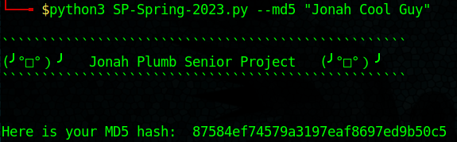
 

## SHA256
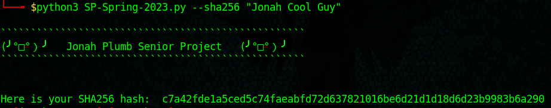
 

## SHA512 
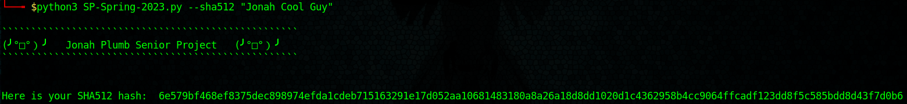
 

## Base64
Encrypt  
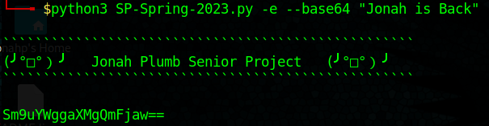
 

Decrypt  
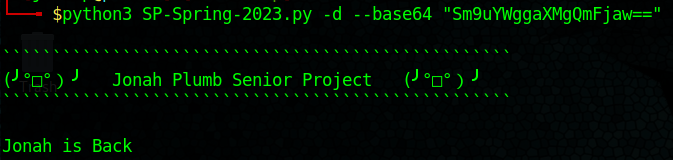
 

## Binary
Encrypt  
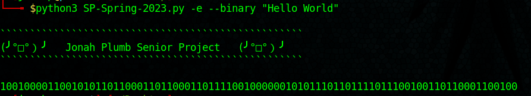
 

Decrypt  
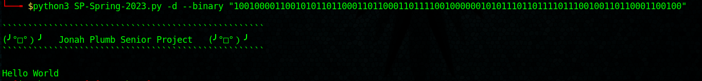
 

## Vigenere
Encrypt  
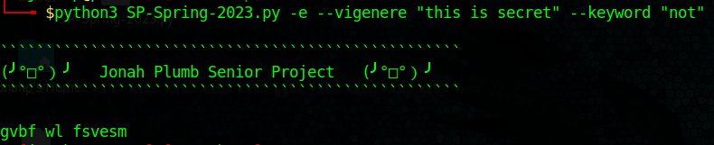
 

Decrypt  
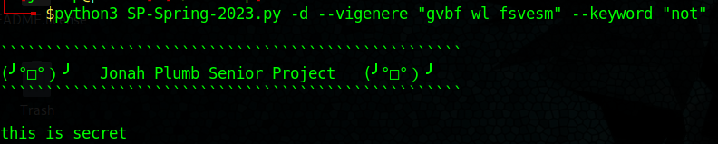
 

## Caesar
Encrypt  
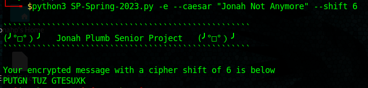
 

Decrypt w/Brute Force Method  
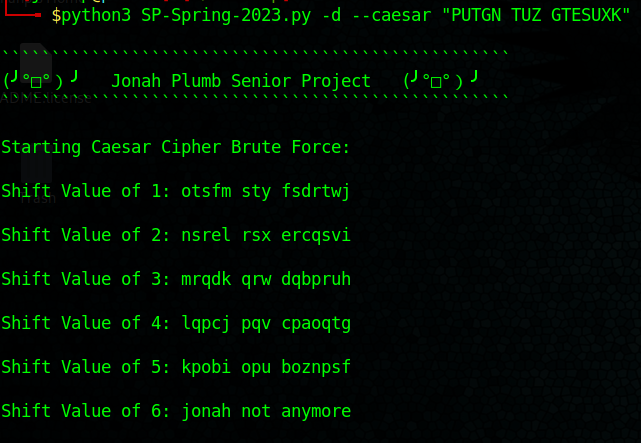
 

