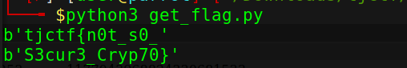

## rsa-apprentice

## Description
My friend sent me this secret message but I can't figure out how to decrypt it! Can you help?  
[problem.txt](./problem.txt)

# How To
In our file we are given `n`, `e` and our `ciphertext`. One of the first things we want to do is plug `n` into [factordb](http://factordb.com/)  
and see if we can find `p` and `q`. Lucky for us it is fully factored on factordb. If we plug `n` in we get:  
`p = 1033247481589406269253`  
`q = 1177043968824330681533`  
From here with all the information we have, we can write a simple python [script](./get-flag-tjctf.py) to solve this for us. 
This [video](https://www.youtube.com/watch?v=_lg2AEqRTjg&t=222s) from John Hammond explains the script very well in a similar challenge, only thing to note is his version is in python2. 
So in our script we will have to change the last line of code to `print(decode(hex(m1)[2:],'hex'))` if your using python3.

## Flag 

